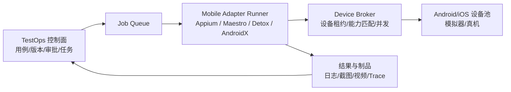

# 2026-08-19 APP 自动化测试项目调研

## 摘要

本次调研聚焦 GitHub 与官方文档中仍在维护或具有代表性的 APP 自动化测试项目，比较它们的测试表达层、平台适配层、设备资源层和执行治理方式。结论不是选出唯一工具，而是识别可组合的架构边界：Appium 适合跨平台协议与驱动生态，Maestro 适合低门槛黑盒流程，Detox 适合 React Native 灰盒端到端测试，AndroidX Test 适合 Android 原生 instrumentation，idb 与设备农场项目适合设备控制和资源编排，Poco 适合跨引擎/游戏 UI 检查，Marathon 适合批量执行、分片和重试。

## 调研范围

- 只记录官方仓库或官方文档明确写出的架构与依赖，不把 GitHub star 数当作质量证明。
- 关注移动端 UI/E2E 自动化、设备控制、并行执行和与 TestOps 的衔接。
- 访问日期为 2026-08-19；版本、兼容矩阵和云服务能力可能继续变化。

## 项目与技术栈

| 项目 | 定位与技术栈 | 架构要点 | 适用场景 |
| --- | --- | --- | --- |
| [Appium](https://github.com/appium/appium) | Node.js HTTP 服务端；W3C WebDriver；Java、Python、Ruby、.NET 等客户端；驱动和插件通过 CLI 管理 | Client → Appium Server → Driver → 平台自动化后端/设备；驱动与插件可独立安装、升级 | Android、iOS、混合应用以及需要跨语言/跨平台的团队 |
| [Appium UiAutomator2 Driver](https://github.com/appium/appium-uiautomator2-driver) | Appium Android 驱动；设备侧 `uiautomator2-server` 将请求转换为 Android UIAutomator 调用 | Appium 驱动在主机侧编排，设备侧服务执行低层 UI 操作，可支持 native/webview context | Android 原生和混合应用的跨语言自动化 |
| [Maestro](https://github.com/mobile-dev-inc/Maestro) | Kotlin 为主；Java 17+；YAML 流程；解释执行引擎；支持 Android、iOS、Web | CLI/Flow Parser → interpreted engine → 平台驱动/设备；内置 smart waiting，不要求每次流程编译 | 快速编写可读的黑盒 UI/E2E 流程，适合冒烟和回归 |
| [Detox](https://github.com/wix/Detox) | JavaScript/TypeScript 测试 API；Jest 集成；Android/iOS 原生客户端；Node.js | Host Tester 负责测试逻辑、设备管理和制品；WebSocket Mediator 连接 Tester 与集成到被测 App 的 Native Client；通过监控异步活动降低等待型不稳定 | React Native 灰盒 E2E，尤其适合需要等待应用内部异步状态的场景 |
| [AndroidX Test](https://github.com/android/android-test) | Java/Kotlin；JUnit 4；Espresso、UIAutomator、AndroidJUnitRunner、Orchestrator 等 | 测试 APK 与被测 APK 通过 Android instrumentation 运行；Orchestrator 将每条测试放入独立 instrumentation 实例 | Android 原生组件测试、稳定的进程级隔离和 CI 执行 |
| [idb](https://github.com/facebook/idb) | macOS `idb_companion` + 可远程运行的 Python 客户端/CLI；基于 FBSimulatorControl 与 FBDeviceControl | 每个模拟器/真机挂一个 companion；客户端通过远程原语控制目标，可向设备实验室扇出分片 | iOS 模拟器/真机控制、设备实验室基础设施和非 Xcode GUI 自动化 |
| [Poco](https://github.com/AirtestProject/Poco) | Python；UI inspection；可序列化 query expression；UI proxy、层级选择器和归一化坐标 | 通过 UI 代理/节点树查询引擎或应用 UI，并保留坐标操作作为兜底；可与 PocoUnit/unittest 配合 | 游戏、Unity/跨引擎 UI、原生 UI 树可检查但标准选择器不足的场景 |
| [Marathon](https://github.com/MarathonLabs/marathon) | Java 运行时；Marathonfile/Gradle 配置；Android、iOS 与自定义硬件农场 | Test batching、device pools、test sharding、排序、预防性重试和事后重试由独立 Runner 编排 | 大量设备上的批量执行、耗时优化与 flaky 测试控制 |
| [Appium Device Farm](https://github.com/AppiumTestDistribution/appium-device-farm) | Appium 2 插件；Android、iOS、tvOS 真机/模拟器；会话分配、Hub/Node、日志和视频 | 在 Appium 之上增加设备注册、会话调度、并行执行和可观测性；它是资源层插件，不是新的测试 DSL | 自建设备池、跨设备并行和 Appium 会话治理 |

## 共性架构模式

### 1. 测试表达与执行实现分离

Appium 用 WebDriver HTTP 协议把客户端和服务端解耦；Maestro 用 YAML 流程和解释器降低测试表达成本；Detox、AndroidX Test 则把更强的语言/原生能力留在测试代码中。测试 DSL 或测试框架不应直接管理所有设备生命周期。

### 2. 平台适配器是独立边界

Appium Driver、Detox Native Client、AndroidX instrumentation、idb companion 都承担“把通用测试意图转换成平台动作”的职责。适配器应有独立版本和能力声明，避免把 Android、iOS、React Native、Flutter 或游戏引擎的差异散落在业务用例里。

### 3. 设备资源调度需要独立于用例执行

Marathon 的 device pool/sharding/retry 与 Appium Device Farm 的 session allocation 说明：设备占用、并发、租约、健康检查、日志视频采集和失败重试应由资源/执行层负责，而不是由每条用例自行处理。

### 4. 黑盒、灰盒和原生 instrumentation 是不同取舍

Maestro 主要通过可见 UI 进行黑盒流程；Detox 为 React Native 测试集成 Native Client 并监控应用异步状态；AndroidX Test 进入 Android instrumentation。三者的稳定性、侵入性和适用范围不同，不能仅用“跨平台”一个指标比较。

## 对 TestOps 的架构启示

建议在现有控制面/执行面设计上增加移动端专用的四段协议：

- `Mobile Adapter Runner` 读取不可变运行快照，固定用例基线、脚本包、设备画像和适配器版本。
- `Device Broker` 只负责能力匹配、租约、清理和资源健康，不承载业务断言。
- Appium、Maestro、Detox、AndroidX Test 作为可替换适配路径，统一输出结构化结果协议。
- 设备日志、截图、视频、网络记录和原生测试报告进入对象存储，再由控制面聚合为 Test Run。
- 首个落地路径可先实现 `MobileAppiumAdapter`；React Native 项目再增加 Detox，原生 Android 组件测试再接 AndroidX Test。

## 局限

- 各项目的性能、稳定性和兼容性没有在本次调研中独立复测；厂商/维护者的自述不等于横向基准。
- Appium 本身是自动化服务与生态，不是完整的测试断言框架；测试运行器、报告和设备农场需要另行选择。
- Maestro Studio/Cloud 等配套能力不等于 GitHub 仓库中的开源代码；云端并行能力不能默认视为可自建能力。
- Detox 对 React Native 有明确偏向；AndroidX Test 偏 Android 原生；idb 依赖 macOS 侧 companion；不能把它们当成同一个跨平台抽象。
- 设备农场的真机签名、USB/网络拓扑、iOS macOS 节点和数据清理策略需要按组织环境单独验证。

## 关联

- [[20 Knowledge/APP 自动化测试平台应分离测试引擎、平台适配与设备资源层]]：从项目证据中提炼可复用的移动端平台架构原则。
- [[20 Knowledge/成熟 TestOps 平台优先分离职责边界]]：移动端资源层和适配层是治理、执行、结果逻辑分层在 App 场景下的具体化。
- [[TestOps Platform]]：现有方案已预留 `MobileAppiumAdapter`，本调研补充其技术栈和设备执行边界。
