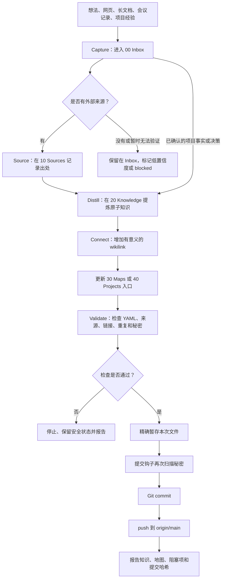

# 自生长知识库使用方法

## 一句话说明

这套知识库把零散想法、长文档、网页、会议记录和项目经验，逐步转化为有来源、可复用、可链接、可审计、可回滚的知识网络。

“自生长”表示：用户发出整理指令后，Claudian 调用 Codex，按本 Vault 的规则完成提炼、连接、索引、校验和 Git 版本化。它不会在后台未经请求地修改文件。

## 它解决什么问题

- 大文档越来越长，重要结论难以再次发现。
- 同一知识散落在多个文档中，容易重复或互相冲突。
- AI 整理后的内容缺少来源，无法判断是否可信。
- 项目决策与通用知识混在一起，难以复用。
- 修改没有版本记录，出错后难以确认变化或回滚。
- 笔记只有文件夹，没有入口、地图和明确的处理状态。

最终目标不是积累更多文件，而是让有价值的知识能够被找到、理解、验证和应用。

## 系统组成

| 组件 | 主要职责 | 不负责什么 |
|---|---|---|
| Obsidian | 阅读、编辑、双向链接、知识地图和人工确认 | 不独立执行 AI 整理 |
| Claudian | 在 Obsidian 中提供对话和工具界面 | 不单独定义知识库规则 |
| Codex | 读取规则、调用技能、编辑文件、验证并运行 Git | 不把模型输出当作事实来源 |
| `$knowledge-gardener` | 执行捕获、来源化、提炼、连接和审查工作流 | 不绕过安全边界 |
| Git | 记录每次变化、比较差异、回滚和同步 | 不判断内容是否正确 |
| GitHub | 保存远端版本并提供跨设备同步 | 不替代本地 Vault 和来源管理 |

当前 Claudian 使用 Codex Provider，工作区安全模式为 `workspace-write`。模型或 CLI 版本以后可以变化，但本知识库的行为仍由 [[AGENTS]]、[[90 System/Knowledge Base Protocol|知识库协议]]、[[90 System/Autonomous Gardening Rules|自主整理规则]] 和技能共同约束。

## 目录与职责

| 目录 | 内容 | 典型状态 |
|---|---|---|
| `00 Inbox/` | 原始想法、摘录、问题、会议记录和待验证材料 | `unprocessed`、`processed`、`blocked` |
| `10 Sources/` | 网页、报告、书籍、会议等外部来源笔记 | `seed`、`growing` |
| `20 Knowledge/` | 一篇只表达一个稳定概念、结论、模式或决策的原子知识 | `seed`、`growing`、`evergreen` |
| `30 Maps/` | 主题入口和知识关系地图 | `growing` |
| `40 Projects/` | 项目目标、应用、决策和交付物 | 依据项目状态 |
| `90 System/` | 协议、规则、模板和使用手册 | `evergreen` |
| `99 Archive/` | 经用户确认后归档的不活跃内容 | `archived` |

## 规则从哪里生效

规则按以下层次协作：

1. `AGENTS.md`：Codex 进入 Vault 后自动遵守的总规则和授权边界。
2. `.agents/skills/knowledge-gardener/SKILL.md`：知识整理的可复用执行步骤。
3. [[90 System/Knowledge Base Protocol|知识库协议]]：信息生命周期、元数据和原子笔记标准。
4. [[90 System/Autonomous Gardening Rules|自主整理规则]]：自然语言触发、默认自动化范围和 Git 收尾方式。
5. `90 System/Templates/`：Inbox、来源、原子知识和知识地图的文件结构。

用户当次指令可以缩小本次范围，例如“只检查一下”或“整理一下，不提交”，但不能要求绕过秘密扫描或其他安全规则。

## 整个工作链路



## 信息生命周期

### 1. Capture：先收集

把尚未整理的材料放入 `00 Inbox/`，建议一份材料一篇笔记，并使用 [[90 System/Templates/Inbox Item|Inbox Item 模板]]。

Capture 阶段保留原始内容和上下文，不急着改写结论。材料至少应说明它来自哪里、为什么值得保存，或者当前想解决什么问题。

### 2. Source：记录来源

外部事实先进入 `10 Sources/`。来源笔记保存作者、URL、发布日期、访问日期、摘要、可支持的结论和局限。

AI 生成内容不能作为事实来源。无法验证的内容必须保持低置信度或留在 Inbox。

### 3. Distill：提炼原子知识

稳定、可复用并且证据充分的单一结论进入 `20 Knowledge/`。一篇原子笔记应做到：

- 标题直接表达结论或概念。
- 开头能够独立说明核心结论。
- 区分事实、推断、经验和假设。
- 通过 `sources` 或正文链接回来源。
- 说明适用边界、反例或冲突。

### 4. Connect：建立关系

新知识必须能从 Home、一个知识地图或一个项目入口到达。链接应说明两篇笔记为什么相关，而不是为了增加链接数量。

`30 Maps/` 负责主题导航，不复制原子知识正文。

### 5. Apply：应用到项目

`40 Projects/` 引用稳定知识来支持项目决策和交付物。项目文件描述“本项目如何使用知识”，而不是复制一份知识内容。

### 6. Review：定期检查

Review 检查以下问题：

- 孤立笔记。
- 重复或可能重复的知识。
- 相互冲突的结论。
- 缺少来源或置信度不合理的内容。
- 长期没有更新的主题。
- 地图中存在但没有实际笔记的主题。

发现重复时只创建合并建议，不自动合并。

### 7. Archive：经确认归档

移动到 `99 Archive/` 属于高风险动作，必须先获得用户明确批准。归档不是删除，仍保留来源、链接和 Git 历史。

## 用户怎么使用

### 完整整理并同步

在 Claudian 中输入：

```text
整理一下
```

它会处理所有 `processing_status: unprocessed` 的 Inbox 材料，完成安全的增量修改、校验、提交和推送。

### 整理但不提交 Git

```text
整理一下，不提交
```

它会修改笔记并完成检查，但把 Git 提交和推送留给用户确认。

### 只读健康检查

```text
只检查一下
```

它只报告孤立、重复、冲突、来源缺口和过期内容，不修改文件。

### 整理指定材料

```text
整理一下 00 Inbox/某份会议记录.md
```

它只处理指定材料，以及为了连接该材料而必须更新的来源、知识、地图或项目入口。

### 查询知识而不整理

```text
根据当前知识库回答：已发布用例基线为什么必须保持只读？
引用相关笔记，并指出证据不足或存在冲突的部分。本次不要修改文件。
```

## “整理一下”的默认执行步骤

1. 读取 Home、协议、规则、相关地图和目标材料。
2. 执行 `git status`，要求工作区在开始前干净。
3. 找到 `processing_status: unprocessed` 的 Inbox 材料。
4. 搜索标题、别名和关键词，避免重复。
5. 为外部材料创建或复用来源笔记。
6. 提炼可复用的原子知识；证据不足的材料标记为 `blocked`。
7. 更新地图或项目入口。
8. 更新 Inbox 状态、处理日期和 `outputs` 链接，但保留原文。
9. 检查 frontmatter、来源、wikilink、文件名、重复和 `git diff --check`。
10. 精确暂存本次文件，不使用 catch-all staging。
11. 让 pre-commit 钩子扫描凭据。
12. 创建 `knowledge:` 提交并推送 `origin/main`。
13. 报告新增、修改、阻塞项、提交哈希和同步状态。

如果没有可安全处理的新材料，则报告“无需整理”，不创建空提交。

## Inbox 状态如何避免重复处理

Inbox 单条材料使用以下字段：

```yaml
processing_status: unprocessed
processed: ""
outputs: []
```

整理成功后：

```yaml
processing_status: processed
processed: 2026-08-11
outputs:
  - "[[20 Knowledge/已发布用例基线必须保持只读]]"
```

证据不足或需要用户决定时：

```yaml
processing_status: blocked
```

阻塞材料保留在 Inbox，不会被提升为高置信度知识。

## Git 与知识库的关系

### Git 记录什么

Git 记录 Markdown、规则、模板和知识地图的变化。每次提交是一次可审计的知识库状态：可以查看谁改了什么、为什么改，以及必要时回到旧版本。

### Git 不记录什么

以下内容是设备本地状态或可能包含环境信息，不进入仓库：

- `.claudian/` 会话和本机 Provider 设置。
- `.obsidian/plugins/` 插件文件。
- Obsidian workspace、缓存和回收站。
- `.env`、私密目录、证书和其他秘密文件。

### 分支和远端

- 主分支：`main`
- 远端：`origin`
- GitHub 仓库：`ZMAX-A/codex`
- 正常整理只允许把经过验证的快进提交推送到 `origin/main`。

### 提交类型

- `knowledge:`：新增或更新知识、来源和地图。
- `config:`：规则、模板或知识库配置变化。
- `security:`：安全保护和秘密清理。
- `chore:`：初始化或不改变知识含义的维护工作。

### 为什么必须精确暂存

知识园丁只能暂存本次明确审查过的文件，不能使用 `git add .`、`git add -A` 或 `git commit -a`。这可防止把用户正在编辑的其他内容、插件状态或秘密一起提交。

### pre-commit 钩子

`.githooks/pre-commit` 在提交前检查暂存区中的常见 API Key、Token 和私钥模式。发现疑似秘密时提交会被阻止，不允许绕过钩子。

钩子是最后一道保护，不代表可以把凭据临时放入 Vault。任何秘密都应存入专用密码管理器或平台密钥管理页面。

## 自动操作与人工确认边界

### 默认可以自动完成

- 创建来源笔记和原子知识。
- 小范围补充来源、frontmatter、关联和更新时间。
- 更新相关知识地图或项目入口。
- 修复本次新增内容造成的格式或链接问题。
- 检查通过后精确暂存、提交和推送。

### 必须停止并询问用户

- 删除、移动、重命名、合并、归档或批量改写文件。
- 覆盖冲突观点或改变既有项目决策。
- 把低置信度内容升级为已确认事实。
- 提交本次开始前已经存在的修改。
- 发现密码、API Key、Token、Cookie、私钥或环境变量值。
- Git、链接、秘密扫描、提交或推送失败后需要绕过保护。

## Git 异常时会怎样

### 开始前工作区不干净

知识园丁停止，不把已有修改混入本次整理。用户可以先提交、撤销或明确指定如何处理这些修改。

### 校验失败

不提交。保留可检查的工作区状态并报告具体文件和问题。

### pre-commit 阻止提交

立即停止，检查是否存在真实凭据。真实凭据需要先在对应平台作废或轮换，再从文件和 Git 历史中清理。

### commit 成功但 push 失败

不重复创建提交，也不强制推送。报告本地提交哈希和失败原因，待网络或权限恢复后继续推送。

### 远端出现新提交

不自动覆盖远端。先获取远端并确认能否安全快进；存在分叉或冲突时请求用户决定。

## 当前知识库示例

原始设计文档 [[TestOps Platform]] 是项目总体来源。知识园丁已从中提炼 [[20 Knowledge/已发布用例基线必须保持只读|已发布用例基线必须保持只读]]，并把它加入 [[30 Maps/Knowledge Map|Knowledge Map]] 的“测试治理”主题。

这展示了标准链路：

```text
长项目文档
  → 识别稳定结论
  → 创建原子知识
  → 链接回来源
  → 更新知识地图
  → Git 校验、提交和推送
```

## 推荐使用节奏

- 随时：把材料放入 Inbox，不要求当场整理。
- 每天或材料积累后：说“整理一下”。
- 每周：说“只检查一下”，查看孤立、重复、冲突和来源缺口。
- 每月：审查 `blocked` 材料和归档建议；归档前人工确认。
- 规则或模板发生变化后：使用 `config:` 提交并确认 Home 中的入口仍有效。

## 使用检查清单

### 放入材料前

- 是否包含密码、API Key、Token、Cookie 或私钥？如果有，不要放入 Vault。
- 是否能说明来源或上下文？
- 是否应该单独创建一篇 Inbox 材料？

### 整理完成后

- 是否生成了可独立理解的知识？
- 是否有来源或明确的低置信度标记？
- 是否从地图或项目入口可达？
- Inbox 是否记录了处理状态和输出？
- Git 是否只提交了本次相关文件？
- 本地 `main` 是否与 `origin/main` 同步？

## 快速入口

- [[Home]]
- [[00 Inbox/Inbox|Inbox]]
- [[30 Maps/Knowledge Map|Knowledge Map]]
- [[90 System/Knowledge Base Protocol|知识库协议]]
- [[90 System/Autonomous Gardening Rules|自主整理规则]]
- [[90 System/Templates/Inbox Item|Inbox Item 模板]]
- [[90 System/Templates/Source Note|来源笔记模板]]
- [[90 System/Templates/Atomic Note|原子知识模板]]
