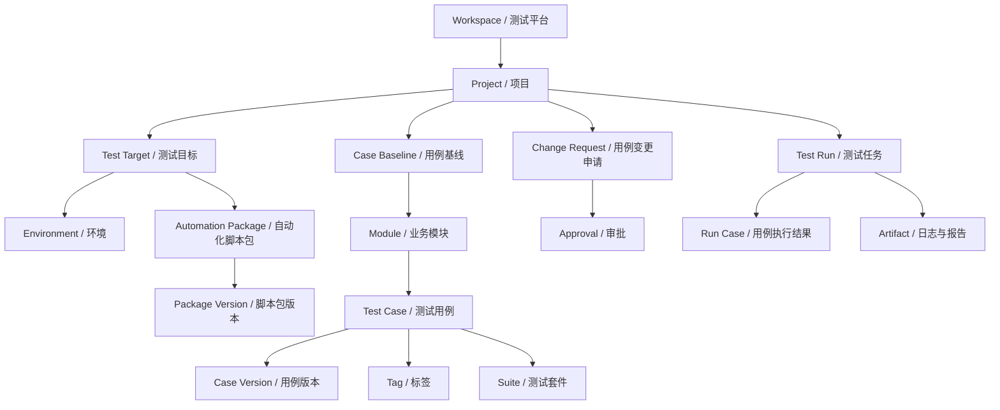
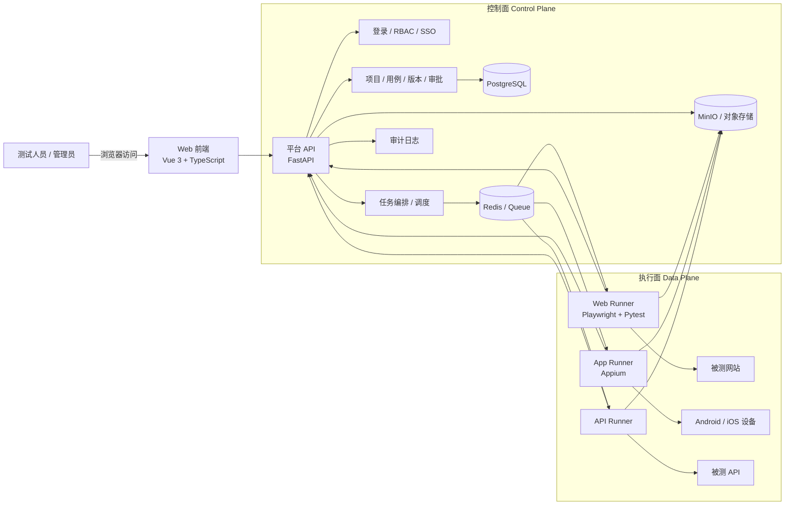
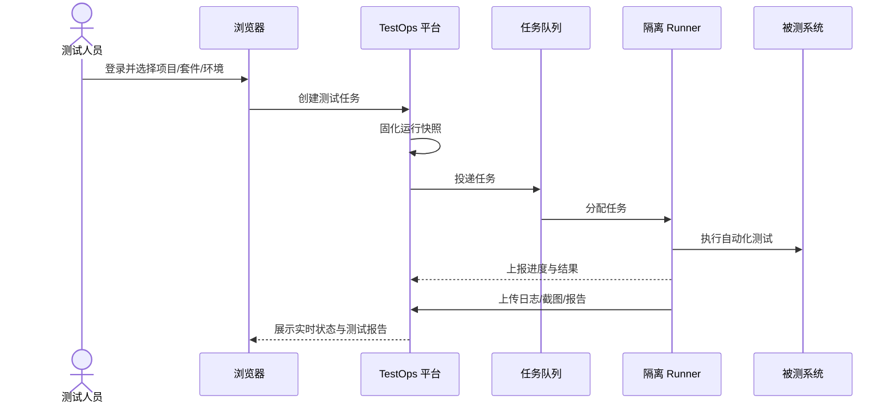
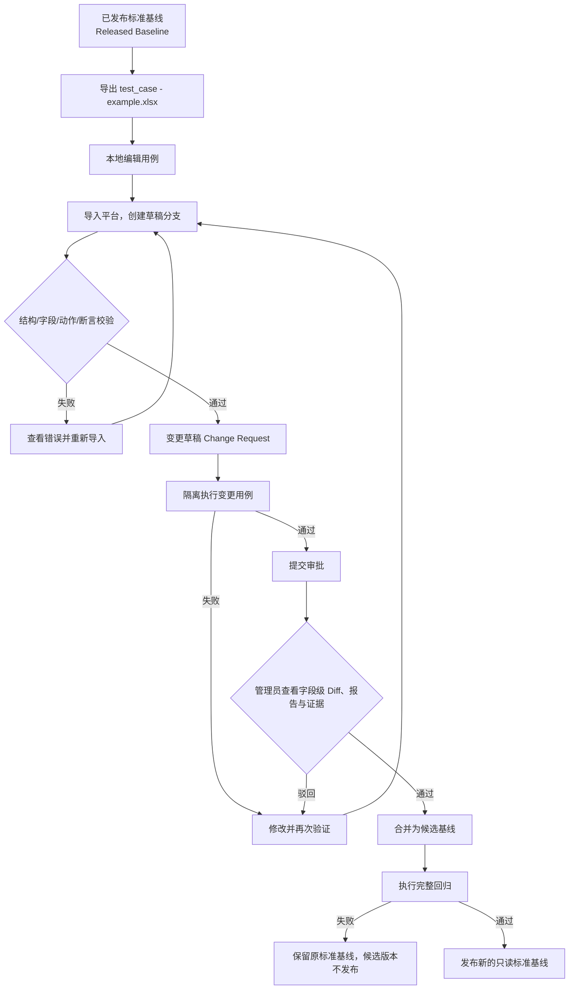
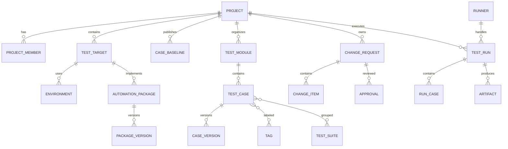

---
aliases:
  - 多项目自动化测试治理与执行平台
  - 自动化测试平台
tags:
  - TestOps
  - 自动化测试
  - 平台架构
  - 测试治理
status: 方案设计
version: V1.0
updated: 2026-08-07
---

# TestOps Platform

> [!abstract] 项目定义
> **正式名称：多项目自动化测试治理与执行平台 V1.0**  
> **简称：TestOps Platform**  
> 这是一个面向团队的多项目自动化测试平台。使用者只需通过浏览器访问平台，不需要在个人电脑上安装 Python、Playwright、浏览器驱动或 Appium。平台统一管理项目、用例、自动化脚本、版本、审批、执行环境、测试报告与审计记录。

## 1. 建设目标

当前“颜佳AI Web 自动化测试”项目已经具备基于 **Playwright + Pytest + Excel + Allure** 的数据驱动自动化执行能力。下一步不是简单地把脚本放到网页上运行，而是将它演进为一个具备治理能力的 TestOps 平台。

平台需要同时解决四类问题：

1. **统一入口**：输入网址并登录，即可选择项目、用例集和环境发起测试。
2. **用例治理**：已发布的标准回归用例受到保护，任何修改都必须经过验证和审批。
3. **多项目扩展**：能够接入不同网站，并逐步扩展到 App、API 等自动化类型。
4. **可追溯执行**：每次运行都能还原当时使用的用例版本、脚本版本、环境与结果证据。

> [!important] 核心判断
> 现有项目不是未来平台本身，而是平台中的第一个 **Web 自动化执行引擎/适配器**。平台负责“管什么、谁能改、运行哪个版本”，现有脚本负责“具体如何操作页面并完成断言”。

---

## 2. 核心设计原则

### 2.1 标准用例不可直接修改

- 已发布的标准回归用例是只读基线（Released Baseline）。
- 普通成员不能直接编辑、覆盖或删除标准用例。
- 所有修改必须从某个已发布基线派生出草稿，再经过测试、审批、合并和发布。
- 发布新版本失败时，原有标准版本继续有效，不能被污染。

### 2.2 Excel 是交换格式，数据库是唯一事实来源

- `test_case - example.xlsx` 继续作为同事易用的导入/导出模板。
- 平台数据库中的结构化用例和版本快照才是 Source of Truth。
- Excel 导入后不能直接替换数据库；它只会创建“用例变更草稿”。
- 导出文件应带有隐藏元数据：`project_id`、`target_id`、`base_version`、`schema_version`、`export_id`、导出人、导出时间和校验值。

### 2.3 用例版本与自动化脚本版本分离

- **用例版本**描述测什么：步骤参数、测试数据、预期结果、优先级、标签等。
- **脚本包版本**描述怎么测：页面对象、关键字执行器、断言执行器、驱动依赖等。
- 每次运行必须同时固定两者，例如：
  - `case-baseline: 1.3.0`
  - `automation-package: yanjia-web@1.8.2`
- 脚本升级不应悄悄改变历史用例；历史运行必须仍然可审计和复现。

### 2.4 项目、测试目标、模块、套件分层

- **不同产品/网站**：建立不同项目或测试目标。
- **同一网站的不同业务区域**：使用模块管理。
- **同一网站的不同测试目的**：使用标签和测试套件组合，不复制整套脚本。
- **Web、App、API**：作为测试目标类型和执行适配器，而不是互相耦合的脚本分支。

### 2.5 执行隔离且可复现

- 每个测试任务在独立进程或容器中运行。
- 不同任务之间不共享浏览器上下文、账号登录态或 `.auth_state.json`。
- 任务创建时生成不可变运行快照，固定用例、脚本、环境、浏览器/设备和配置哈希。
- 日志、截图、视频、Trace、Allure 结果等统一上传到对象存储。

---

## 3. 业务领域模型



### 3.1 各层职责

| 层级 | 说明 | 示例 |
|---|---|---|
| Workspace | 企业或团队级测试空间 | 研发测试中心 |
| Project | 被测试的业务产品 | 颜佳AI |
| Test Target | 可独立配置和执行的测试对象 | 海外版 Web、管理后台 Web、Android App |
| Environment | 目标对应的环境和变量 | 测试环境、预发布环境 |
| Automation Package | 某类目标的自动化实现 | `yanjia-overseas-web` |
| Package Version | 不可变的脚本制品版本 | `1.8.2` |
| Case Baseline | 一组已发布标准用例的快照 | `case-v1.3.0` |
| Module | 业务功能分类 | 登录、顾客、案例、影像 |
| Tag | 用例属性 | P0、冒烟、权限、负向、跨浏览器 |
| Suite | 为某个测试目的组织的用例集合 | 冒烟测试、登录专项、完整回归 |

### 3.2 颜佳AI 的落地示例

```text
项目：颜佳AI
└─ 测试目标：Web
   ├─ 环境：测试 / 预发布
   ├─ 自动化脚本包：yanjia-overseas-web@1.0.0
   ├─ 标准用例基线：case-v1.0.0
   ├─ 模块
   │  ├─ 登录
   │  ├─ 首页
   │  ├─ 顾客列表
   │  ├─ 顾客详情
   │  ├─ 影像管理
   │  └─ 案例管理
   └─ 测试套件
      ├─ 冒烟测试
      ├─ 登录专项
      ├─ 顾客专项
      ├─ 影像专项
      └─ 完整回归
```

### 3.3 如何并入新网站或新测试点

| 新需求 | 正确做法 |
|---|---|
| 新增一个完全不同的网站 | 创建新项目或新测试目标，并注册独立脚本包 |
| 同一产品增加管理后台 | 在同一项目下增加 `管理后台 Web` 测试目标 |
| 同一网站增加登录测试点 | 在现有目标下增加登录模块用例和对应标签/套件 |
| 同一批用例既属于冒烟又属于回归 | 通过多对多关系加入两个套件，不复制用例 |
| 增加 Android App 测试 | 创建 App 类型目标，交由 Appium 适配器执行 |
| 增加 API 测试 | 创建 API 类型目标，交由 API 适配器执行 |

---

## 4. 总体架构

平台采用 **控制面（Control Plane）与执行面（Data Plane）分离** 的设计。



### 4.1 控制面职责

- 用户、团队、项目成员和权限管理。
- 项目、测试目标、环境和密钥引用管理。
- 用例导入、校验、差异对比、审批、合并和发布。
- 自动化脚本包登记、版本兼容性和制品管理。
- 测试任务创建、排队、取消、超时和重试。
- 报告聚合、缺陷证据、通知和审计。

### 4.2 执行面职责

- 接收一份不可变的测试任务快照。
- 准备相应版本的脚本包与运行环境。
- 执行选中的用例，并持续上报心跳和进度。
- 支持取消、超时和资源回收。
- 上传结构化结果、日志、截图、视频、Trace 和报告。

### 4.3 用户电脑零环境

用户侧只需要浏览器。Python、Playwright、Chromium、Appium、Java、Android SDK 等依赖统一安装在平台 Runner 中。



---

## 5. 现有自动化脚本在平台中的角色

当前仓库应被改造成第一个 `WebPlaywrightAdapter`，而不是被平台重写。

| 当前模块 | 现在的职责 | 平台化后的角色 |
|---|---|---|
| `pages/` | 页面对象与业务操作 | 颜佳AI Web 脚本包的站点实现层 |
| `utils/step_executor.py` | 解释并执行关键字步骤 | Web 适配器的通用动作引擎 |
| `utils/assertion_executor.py` | 执行断言 | Web 适配器的断言引擎 |
| `utils/case_validator.py` | 校验 Excel 用例 | 平台导入校验和 Runner 二次校验 |
| `utils/excel_handler.py` | 读写 Excel、回写结果 | 过渡期导入/导出适配器；后续不再作为事实来源 |
| `tests/test_core_cases.py` | Pytest 执行入口 | Runner 内部的通用执行入口 |
| `tests/conftest.py` | 浏览器、环境、登录态与附件 | 单任务隔离的运行上下文 |
| `reports/`、`screenshots/` | 本地结果 | 上传对象存储的任务制品 |

### 5.1 脚本与用例的边界

- 脚本提供稳定能力，例如：`login`、`open_customer`、`create_case`、`upload_image`。
- 用例引用稳定的 `action_key` 或 `scenario_key`，传入测试数据并声明断言。
- 用例不直接依赖 Python 文件名、类名或函数名，避免脚本重构导致所有用例失效。
- 站点特有逻辑放在该站点脚本包内；通用协议、运行器和结果格式放在平台 SDK 内。

### 5.2 自动化适配器统一协议

```python
class AutomationAdapter:
    def validate(self, job_snapshot): ...
    def prepare(self, job_snapshot): ...
    def execute(self, job_snapshot, reporter): ...
    def cancel(self, run_id): ...
    def collect(self, run_id): ...
    def health(self): ...
```

首批适配器：

- `WebPlaywrightAdapter`：承载当前 Playwright + Pytest 项目。
- `MobileAppiumAdapter`：后续接入 Android/iOS 自动化。
- `ApiTestAdapter`：后续接入接口自动化。

---

## 6. 用例版本控制与审批流程

平台参考 Git 的分支、差异、合并和保护分支思想，但不要求普通测试人员理解 Git 命令。



### 6.1 变更类型

每条变更必须明确标识，不能通过“Excel 中少了一行”推断删除：

- `ADD`：新增用例。
- `MODIFY`：修改已有用例。
- `DELETE`：显式申请删除用例。

### 6.2 审批规则

- 提交人不能审批自己的变更。
- 审批人必须看到字段级差异，而不仅是整个 Excel 文件。
- 审批页面同时展示：变更原因、影响模块、用例 Diff、验证结果、截图、日志和报告。
- 高风险变更可配置双人审批或指定 Code Owner/Module Owner。
- 审批通过不等于立即发布；完整回归通过后才生成新的已发布基线。
- 所有导入、评论、审批、合并、发布和回滚操作写入审计日志。

### 6.3 冲突处理

若草稿基于 `case-v1.2.0`，审批前标准基线已升级到 `case-v1.3.0`：

1. 平台计算三方差异：基础版本、当前版本、草稿版本。
2. 无冲突变更自动 rebase。
3. 同一字段被双方修改时，要求提交人或管理员人工解决。
4. 冲突解决后重新执行受影响用例，原验证结果不得直接复用。

---

## 7. 测试任务快照

每次 Test Run 创建后必须生成不可变快照：

```json
{
  "run_id": "RUN-20260807-0001",
  "project": "yanjia-ai",
  "target": "overseas-web",
  "environment": "staging",
  "case_baseline": "1.3.0",
  "automation_package": "yanjia-overseas-web@1.8.2",
  "suite": "full-regression",
  "browser": "chromium",
  "case_ids": ["TC-LOGIN-001", "TC-DETAIL-031"],
  "config_hash": "sha256:...",
  "created_by": "user-id",
  "created_at": "2026-08-07T11:00:00+08:00"
}
```

运行结束后保留：

- 每条用例的开始/结束时间、状态、失败分类和错误堆栈。
- 截图、视频、Playwright Trace、控制台日志、网络日志和 Allure 结果。
- Runner 版本、操作系统、浏览器/设备版本。
- 用例内容哈希、脚本制品哈希、环境配置版本。
- 重新运行必须创建新的 Run，不覆盖旧结果。

---

## 8. 权限模型

采用 RBAC，并允许按项目配置成员角色。

| 角色 | 主要权限 |
|---|---|
| 测试人员 Tester | 导出模板、导入草稿、执行草稿用例、提交审批、查看报告 |
| 评审人员 Reviewer | 查看 Diff、报告和证据，评论，提出修改意见 |
| 项目管理员 Project Admin | 审批、合并、发布、回滚、项目配置和成员管理 |
| 系统管理员 System Admin | 用户、Runner、全局配置、存储和系统审计 |
| 只读成员 Viewer | 查看项目、标准用例、运行历史和报告 |

权限约束：

- Released Baseline 对所有角色只读，只能通过发布流程产生新版本。
- 环境密钥不向前端和 Excel 明文暴露。
- 权限同时校验“角色 + 项目成员关系 + 资源状态”。
- 关键操作需要二次确认并记录操作者、时间、原因和前后版本。

---

## 9. 核心数据模型

### 9.1 建议的数据表

| 领域 | 核心表 |
|---|---|
| 用户与权限 | `users`、`roles`、`projects`、`project_members` |
| 测试目标 | `test_targets`、`environments`、`secret_refs` |
| 脚本版本 | `automation_packages`、`package_versions` |
| 用例版本 | `case_baselines`、`test_modules`、`test_cases`、`case_versions` |
| 分类组织 | `tags`、`case_tags`、`test_suites`、`suite_cases` |
| 变更审批 | `change_requests`、`change_items`、`approvals`、`review_comments` |
| 测试执行 | `test_runs`、`run_cases`、`artifacts`、`runners` |
| 审计治理 | `audit_logs`、`notifications` |

### 9.2 关键关系



### 9.3 状态建议

- 用例基线：`CANDIDATE` → `RELEASED` → `ARCHIVED`。
- 变更申请：`DRAFT` → `VALIDATING` → `TESTED` → `IN_REVIEW` → `APPROVED` / `REJECTED` → `MERGED`。
- 测试任务：`QUEUED` → `PREPARING` → `RUNNING` → `PASSED` / `FAILED` / `CANCELED` / `TIMED_OUT` / `INFRA_ERROR`。
- 脚本包版本：`UPLOADED` → `VERIFIED` → `ACTIVE` → `DEPRECATED`。

---

## 10. 技术选型

### 10.1 推荐主栈

| 层 | 推荐技术 | 说明 |
|---|---|---|
| Web 前端 | Vue 3 + TypeScript + Element Plus | 适合管理后台、表格、Diff 和审批界面 |
| 平台后端 | FastAPI | 与现有 Python 团队和自动化生态一致 |
| 主数据库 | PostgreSQL | 保存项目、用例、版本、审批、任务和审计数据 |
| 缓存/队列 | Redis + Celery | MVP 阶段实现异步任务和状态调度 |
| 对象存储 | MinIO / S3 | 保存脚本制品、截图、视频、Trace 和报告 |
| Web Runner | Playwright + Pytest | 复用当前项目能力 |
| App Runner | Appium | 后续支持 Android/iOS |
| 身份认证 | OIDC / Keycloak / 企业 SSO | 支持统一登录和组织权限 |
| MVP 部署 | Docker Compose | 快速形成团队可访问版本 |
| 生产调度 | Kubernetes Jobs | 实现任务隔离、弹性扩容和资源限制 |
| 监控 | Prometheus + Grafana | 监控任务积压、Runner 健康和资源使用 |

### 10.2 为什么不把 Git 仓库直接当用例数据库

Git 适合保存脚本源码和脚本包构建记录，但普通测试人员需要结构化查询、字段级 Diff、审批状态、权限、执行关联和报表统计。因此：

- **脚本源码**继续使用 Git 管理，并通过 CI 构建不可变脚本包。
- **业务用例**由平台数据库管理，提供类似 Git 的版本与审批体验。
- 发布时可把用例基线同步导出为 JSON/Excel 到归档仓库，作为额外备份和审计材料。

---

## 11. 安全与治理

- 账号、密码、Token 和证书进入密钥服务或加密字段，通过运行时注入；禁止写入 Excel、Git、任务日志和截图名称。
- 不同任务使用独立浏览器上下文和临时目录，完成后销毁。
- 上传 Excel 时限制文件大小、工作表、字段类型和公式，拒绝宏文件，并接入恶意文件扫描。
- Runner 通过短期凭证或签名注册，只能领取授权项目的任务。
- 日志输出进行敏感信息脱敏。
- 对象存储采用私有 Bucket 和短期签名下载地址。
- 平台记录全量审计，但审计日志只能追加，不能由普通管理员删除。
- 测试环境和生产环境权限分离；生产回归需要更严格的授权策略。

---

## 12. 平台页面规划

### 12.1 一级导航

1. **工作台**：待审批、最近任务、失败趋势、Runner 状态。
2. **项目**：项目列表、成员、测试目标、环境、模块和套件。
3. **用例中心**：标准基线、用例检索、导入导出、变更申请、字段级 Diff。
4. **执行中心**：新建任务、队列、实时进度、历史运行、报告。
5. **审批中心**：待我审批、我发起的、已完成、审批规则。
6. **版本中心**：用例基线、脚本包版本、兼容关系、发布和回滚。
7. **系统管理**：用户、角色、Runner、存储、通知、审计。

### 12.2 新建测试任务的最小表单

- 项目
- 测试目标
- 环境
- 用例基线版本
- 自动化脚本包版本（默认选择兼容的 Active 版本）
- 模块 / 标签 / 测试套件 / 指定用例
- 浏览器或设备
- 并发数、失败重试和超时时间

---

## 13. 从当前项目到平台的改造路径

### 阶段 0：冻结标准与定义协议（1～2 周）

- 将当前稳定的 `test_case.xlsx` 固化为 `case-v1.0.0`。
- 为每条用例分配稳定 UUID，同时保留人类可读 `case_code`。
- 定义平台内部用例 JSON Schema、动作注册表和断言注册表。
- 明确 Excel 模板字段、隐藏元数据和导入校验规则。
- 定义 Runner 输入快照与结构化结果协议。

### 阶段 1：MVP（约 6～10 周）

- 登录、RBAC、项目和项目成员。
- 颜佳AI 项目、Web 测试目标和环境管理。
- 标准用例导入、模板导出、草稿导入和静态校验。
- 变更用例隔离执行、字段级 Diff、审批、合并和发布。
- 选择模块/套件/用例发起测试。
- 当前 Playwright 项目封装为 Web Runner。
- 实时状态、结构化结果、截图和 Allure 报告。

**MVP 验收标准：**同事在一台没有安装测试环境的电脑上，仅通过浏览器即可完成“登录 → 导出模板 → 修改并导入 → 验证 → 提交审批 → 管理员合并 → 执行完整回归 → 查看报告”的闭环。

### 阶段 2：生产化（约 4～8 周）

- Runner 容器化、并行调度、超时取消、健康检查和自动回收。
- MinIO 制品存储、任务日志流式查看和报告保留策略。
- SSO、消息通知、多级审批、冲突检测、rebase 和回滚。
- Prometheus/Grafana 监控、任务容量与资源配额。
- 脚本包 CI 构建、签名、兼容性验证和灰度启用。

### 阶段 3：多类型扩展（约 4～8 周）

- Appium Adapter 与 Android 设备池。
- iOS Runner（需要 macOS 节点和真机/模拟器资源）。
- API Adapter。
- 定时回归、Webhook/CI/CD 触发、失败通知和质量门禁。

---

## 14. 首版边界

为了尽快形成可用闭环，首版应当：

### 首版必须做

- 单一平台，多项目数据结构。
- 先完整支持颜佳AI Web 自动化。
- 标准用例保护、导入导出、验证、审批、合并、发布和回滚。
- 选择项目、模块、套件或用例执行测试。
- 服务端统一 Runner，用户电脑零环境。
- 结构化结果、日志、截图和报告。

### 首版暂不做

- 在线可视化录制脚本。
- 低代码拖拽编排器。
- AI 自动生成并直接合并标准用例。
- 大规模跨地域设备云。
- 一开始同时实现 Web、App、API 的全部高级能力。

> [!tip] 产品策略
> 数据模型和适配器协议从第一天支持多项目、多目标，但交付顺序应是“先把一个 Web 项目的完整治理闭环做深，再复制接入能力”。

---

## 15. 架构决策记录（ADR 摘要）

| 编号 | 决策 | 原因 |
|---|---|---|
| ADR-001 | 平台与 Runner 分离 | 治理服务与高资源、不稳定的浏览器任务解耦 |
| ADR-002 | 数据库为用例唯一事实来源 | 支持结构化查询、Diff、审批、权限和运行关联 |
| ADR-003 | Excel 仅作为交换格式 | 保留同事当前使用习惯，同时避免文件覆盖式治理 |
| ADR-004 | 用例版本与脚本包版本分离 | 保证独立演进、历史审计和运行可复现 |
| ADR-005 | Released Baseline 不可变 | 防止标准回归用例被未审批修改污染 |
| ADR-006 | 模块 + 标签 + 套件组织测试点 | 避免为同一网站复制脚本和用例 |
| ADR-007 | 自动化类型通过 Adapter 扩展 | Web、App、API 共享治理能力，执行实现可插拔 |
| ADR-008 | 每次运行生成不可变快照 | 确保结果能解释、能审计、尽可能复现 |

---

## 16. 最终架构结论

1. **平台名称**：TestOps Platform；软著或正式材料可使用“多项目自动化测试治理与执行平台 V1.0”。
2. **当前脚本定位**：第一个 Web 自动化执行适配器，是平台执行面的核心资产，不是一次性脚本。
3. **扩展新网站**：新增项目/测试目标和独立版本化脚本包，不把所有网站代码混进同一套页面对象。
4. **扩展同网站测试点**：新增模块、用例、标签和套件，按测试目的灵活选择，避免复制脚本。
5. **标准用例治理**：已发布基线只读，导入只产生变更草稿；验证通过且管理员审批后，才能合并并经完整回归发布。
6. **用户零环境**：所有依赖和浏览器/设备能力运行在服务端 Runner；同事只使用浏览器。
7. **长期演进**：控制面保持稳定，通过 `WebPlaywrightAdapter`、`MobileAppiumAdapter`、`ApiTestAdapter` 扩展执行类型。

---

## 17. 参考资料

- [Playwright Python：Docker](https://playwright.dev/python/docs/docker)
- [Kubernetes：Jobs](https://kubernetes.io/docs/concepts/workloads/controllers/job/)
- [GitLab：Merge request approvals](https://docs.gitlab.com/user/project/merge_requests/approvals/)
- [GitLab：Protected branches](https://docs.gitlab.com/user/project/repository/branches/protected/)
- [Appium 官方文档](https://appium.io/docs/en/latest/intro/)
- [Keycloak 官方文档](https://www.keycloak.org/documentation)

> [!note] 下一步
> 以本方案为总纲，下一份设计文档应输出：**MVP 产品需求清单、数据库 ER 详细字段、平台 API 契约、Runner Job JSON Schema、用例 Excel/JSON Schema、部署拓扑与开发排期**。
